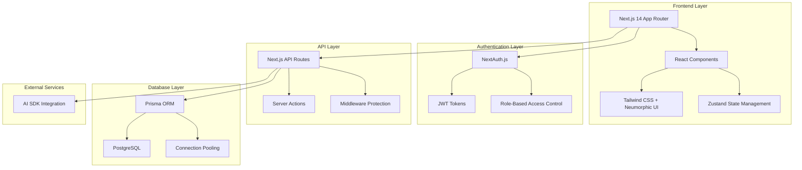

# 🏥 OrthoSim - VR Surgical Training Platform

**Advanced Virtual Reality Surgical Training System for Orthopedic Procedures**

[🚀 Live Demo](#) • [📖 Documentation](#features) • [🛠️ Installation](#installation) • [🤝 Contributing](#contributing)

---

## 📋 Table of Contents

- [🎯 Overview](#overview)
- [✨ Features](#features)
- [🏗️ Architecture](#architecture)
- [🛠️ Tech Stack](#tech-stack)
- [🚀 Installation](#installation)
- [📱 User Flow](#user-flow)
- [🗄️ Database Schema](#database-schema)
- [🔐 Authentication](#authentication)
- [🎨 UI/UX Design](#uiux-design)
- [📊 API Documentation](#api-documentation)
- [🧪 Testing](#testing)
- [🚀 Deployment](#deployment)
- [🤝 Contributing](#contributing)
- [📄 License](#license)

---

## 🎯 Overview

**OrthoSim** is a cutting-edge Virtual Reality surgical training platform designed specifically for orthopedic procedures. The platform connects medical trainees with experienced mentors, providing immersive VR simulations, real-time performance analytics, and comprehensive feedback systems.

### 🎪 Key Highlights

- **🥽 Immersive VR Training**: Realistic surgical simulations with haptic feedback
- **👨‍⚕️ Mentor-Trainee System**: Structured guidance and feedback mechanism
- **📊 Advanced Analytics**: Detailed performance metrics and progress tracking
- **🤖 AI-Powered Assistant**: Intelligent chatbot for surgical guidance
- **🏆 Gamification**: Rankings, leaderboards, and achievement systems
- **🌙 Modern UI**: Neumorphic design with light/dark theme support

---

## ✨ Features

### 🎓 For Trainees

- **Dashboard Overview**: Comprehensive progress tracking and statistics
- **VR Simulation Access**: Immersive surgical procedure training
- **Performance Analytics**: Detailed metrics on surgical precision and efficiency
- **AI Assistant**: 24/7 intelligent surgical guidance and Q&A
- **Feedback System**: Receive detailed mentor feedback on attempts
- **Rankings & Leaderboards**: Compare progress with peers
- **Progress Tracking**: Monitor improvement over time

### 👨‍⚕️ For Mentors

- **Trainee Management**: Oversee multiple trainees' progress
- **Performance Review**: Analyze detailed surgical attempt data
- **Feedback Tools**: Provide structured feedback and ratings
- **Analytics Dashboard**: Monitor trainee performance trends
- **Mentor Code System**: Secure trainee enrollment process
- **Bulk Operations**: Manage multiple trainees efficiently

### 🔧 Administrative Features

- **User Authentication**: Secure login/registration with NextAuth.js
- **Role-Based Access**: Separate interfaces for mentors and trainees
- **Data Security**: Encrypted passwords and secure session management
- **Responsive Design**: Optimized for desktop, tablet, and mobile
- **Theme Support**: Light and dark mode with neumorphic design
- **Real-time Updates**: Live data synchronization across the platform

---

## 🏗️ Architecture

### 🏛️ System Architecture

